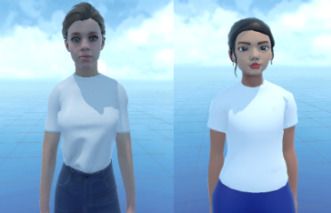

# Empathy Measurement in VR: Avatar Realism and Empathy Induction
This project explores how varying levels of avatar realism in virtual reality (VR) affect empathy induction. VR serves as a powerful "empathy machine," enabling researchers to study how immersive environments influence trait and state empathy responses. By manipulating avatar realism, we measure its impact on empathy in VR.

Key Features:
- Empathy Measurement: Code for measuring trait and state empathy responses.
- Analysis: Scripts for analysing how avatar realism influences empathy in VR-based scenarios.
This project explores how varying levels of avatar realism in virtual reality (VR) affect empathy induction. VR serves as a powerful "empathy machine," enabling researchers to study how immersive environments influence cognitive and affective empathy responses. By manipulating avatar realism, we measure its impact on empathy in VR.

Avatar Realism Comparison:
The following image showcases the differences in avatar realism used in this study:

  

